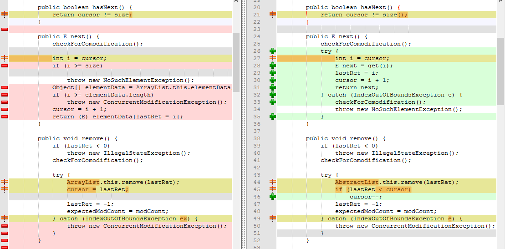
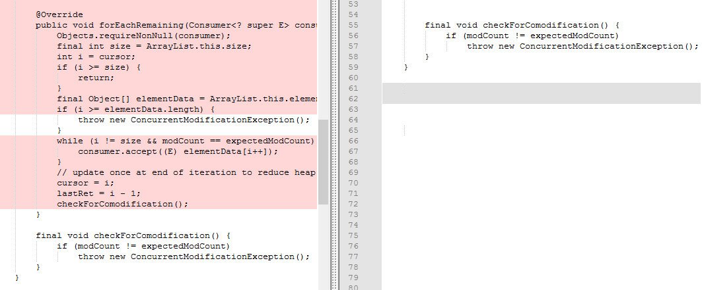

# 设计模式(1)Iterator模式
[编辑文章](https://github.com/WilliamGai/WilliamGai.github.io/edit/master/java/%E8%AE%BE%E8%AE%A1%E6%A8%A1%E5%BC%8F%E4%B9%8B%E7%BE%8E(1)Iterator%E6%A8%A1%E5%BC%8F.md)  
  
---  
  
Iterator是java集合框架的成员,使用了设计模式中的Iterator模式
  
  我们从API中将这种方式提炼出来，并且了解List的设计
  
##  Iterator核心设计

### 1 定义接口

- Iterator
``` java
public interface Iterator<E> {
    boolean hasNext();
    E next();
}
```
- Iterable 用来给实现类继承
``` java
public interface Iterable<T> {
    Iterator<T> iterator();
}
```  

### 2 然后写一个类实现Iterator,即迭代器, 这个类可以是单独的一个类。在ArryayList的设计里,Itr是设计在ArrayList的内部类
``` java
    private class Itr implements Iterator<E> {
        int cursor;       // index of next element to return
        int lastRet = -1; // index of last element returned; -1 if no such
        int expectedModCount = modCount;

        public boolean hasNext() {
            return cursor != size;
        }

        public E next() {
            checkForComodification();
            int i = cursor;
            if (i >= size)
                throw new NoSuchElementException();
            Object[] elementData = ArrayList.this.elementData;
            if (i >= elementData.length)
                throw new ConcurrentModificationException();
            cursor = i + 1;
            return (E) elementData[lastRet = i];
        }
    }
```  

### 3 ArrayList 实现Iterable
``` java
    
    public Iterator<E> iterator() {
        return new Itr();
    }
```  

##  思考
使用 _Iterator_ 这样写有什么好处呢？
1.引入Iterator后可以将比哪里与实现分离开
``` java
    List<Integer> list = new ArrayList<>();
    list.addAll(Arrays.asList(1, 2, 3, 4, 5));
    Iterator<Integer> it = list.iterator();
	while(it.hasNext()){
		System.out.println(it.next());
	}
```
   显然`while`循环并不依赖于`ArraysList`的实现。当API编写人员不用数组来实现`ArrayList`而是用其他的方式,只要能返回正确的`Iterator`实例,`hasNext`方法和`next`方法可以正常工作。不对上面方法做任何修改，代码都可以正常工作。对于`ArrayList`的调用者来说非常方便。
   设计模式的作用就是帮助我们编写可复用的类。所谓“可复用”就是指将类实现为“组件”，当一个组件发生改变时，不需要对其他的组件进行修改或者只需要很小的修改即可对应。
这要也就理解为什么示例程序中`iterator()`的返回值不是、`Itr`而是`Iterator`了。

实际上新的API版本中
Iterator还有一些小细节

- 1 刚才我们已经可以看到我们的接口定义使用了泛型,这说明我们例子的版本已经时JDK1.5或者更新,更旧的版本我们就不讨论了。我一般看jdk1.8
- 3 我们可以看到每次调用ArryaList的迭代器`Iterator()`都会new 一个 Itr()。虽然java对象有自动回收机制。但是这里可不可以用工厂模式来获得？
- 4 java 8 中接口可以定义defalut方法,且接口和类通过继承来获得(接口的静态方法不能继承)。Iterator接口额外提供了`e.remove() `而 Iterable接口额外提供了`foreach()`。最终ArrayList提供的`Itr`覆盖了`default remove()`方法。ArrayList自己覆盖了`foreach()`方法。

  真正的API里的Iterator做了扩展
- 4.1 Iterator
``` java
    public interface Iterator<E> {
        boolean hasNext();

        E next();

        default void remove() {
            throw new UnsupportedOperationException("remove");
        }

        /**
         * behaves as if:
         *     while (hasNext())
          *         action.accept(next());
         * @since 1.8
         */
        default void forEachRemaining(Consumer<? super E> action) {
            Objects.requireNonNull(action);
            while (hasNext())
                action.accept(next());
        	}
    	}
```

- 4.2 Iterable
``` java
    public interface Iterable<T> {
        Iterator<T> iterator();

        default void forEach(Consumer<? super T> action) {
            Objects.requireNonNull(action);
            for (T t : this) {
                action.accept(t);
            }
        }

        default Spliterator<T> spliterator() {
            return Spliterators.spliteratorUnknownSize(iterator(), 0);
        }
    }
```
- 5 ArrayList和Iterable的继承关系
    `ArrayList`是`AbstractList`的子类,`AbstractList`提供了两个迭代器`Itr`和`ListItr`,但是`ArryList`自己重新实现了这两个迭代器。在迭代器的`next`和`remove`和`forEachRemaining`方法中均能抛出`ConcurrentModificationException`异常
    有兴趣的可以对比下ArrayList自己的Itr和AbstractList的Itr的异同。
          
- remove 和 next
    
      
- forEachRemaining
  
  
    
